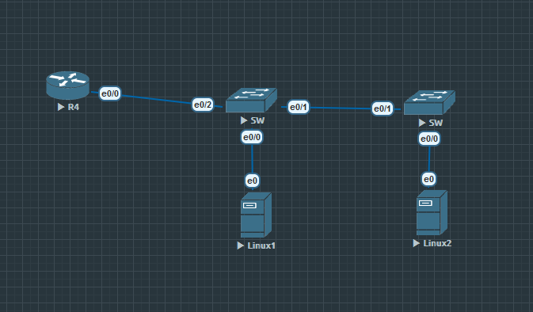
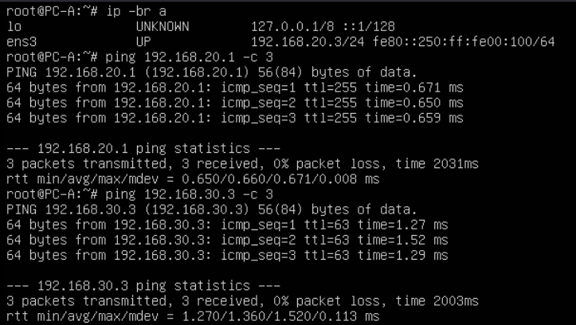

# Лабораторная работа № 1
## Топология



## Part 1
### Создание топологии и базовая настройка коммутаторов и маршрутизатора
1. В начале инициализируем устройство и настраиваем базовые параметры
Для этого выполянем команды в последовательности по заданию 

Router
```
hostname Router-on-Stick
no domain ip lookup
enable secret class
line console 0
password cisco
login
line vty 0 4
transport input ssh
password cisco
login
service password-encryption
banner motd ^CAuthentification is nessesary^C
copy running-config startup-config
clock set MSK 12 12
```
Switch
```
hostname SW-{1-2}
no domain ip lookup
enable secret class
line console 0
password cisco
login
line vty 0 4
transport input ssh
password cisco
login
service password-encryption
banner motd ^CAuthentification is nessesary^C
copy running-config startup-config
clock set MSK 12 12
```
PC-1
#### Данная конфигурация сохранена в netplan (/etc/netplan/00-config.yaml)
```
ip address add 192.168.10.11/24 dev ens3
ip route add default via 192.168.10.1 
```
PC-2
```
ip address add 192.168.10.11/24 dev ens3
ip route add default via 192.168.10.1
```
## Part 2
### Создание VLAN на коммутаторах
Switch 1
```
interface Ethernet0/0
 switchport access vlan 20
 switchport mode access
         
interface Ethernet0/1
 switchport trunk allowed vlan 10,20,30,1000
 switchport trunk encapsulation dot1q
 switchport trunk native vlan 1000
 switchport mode trunk
        
interface Ethernet0/2
 switchport trunk allowed vlan 10,20,30,1000
 switchport trunk encapsulation dot1q
 switchport trunk native vlan 1000
 switchport mode trunk
        
interface Ethernet0/3
 switchport access vlan 999
 switchport mode access
 shutdown 
       
interface Vlan10
 ip address 192.168.10.11 255.255.255.0
        
ip default-gateway 192.168.10.1
```
Switch 2

```
interface Ethernet0/0
 switchport access vlan 30
 switchport mode access
         
interface Ethernet0/1
 switchport trunk allowed vlan 10,20,30,1000
 switchport trunk encapsulation dot1q
 switchport trunk native vlan 1000
 switchport mode trunk
        
interface Ethernet0/2
 switchport access vlan 999
 switchport mode access
 shutdown 
        
interface Ethernet0/3
 switchport access vlan 999
 switchport mode access
 shutdown 
        
interface Vlan10
 ip address 192.168.10.12 255.255.255.0
       
ip default-gateway 192.168.10.1
```
## Part 3
### Настройка VLAN на маршрутизаторе

Router
```
interface Ethernet0/0
 no ip address
        
interface Ethernet0/0.10
 encapsulation dot1Q 10
 ip address 192.168.10.1 255.255.255.0
         
interface Ethernet0/0.20
 encapsulation dot1Q 20
 ip address 192.168.20.1 255.255.255.0
        
interface Ethernet0/0.30
 encapsulation dot1Q 30
 ip address 192.168.30.1 255.255.255.0
     
interface Ethernet0/0.1000
 encapsulation dot1Q 1000
```
## Part 4
### Проверка сетевой связанности
#### Запуск ping с PC-1 до PC-2 и шлюза


