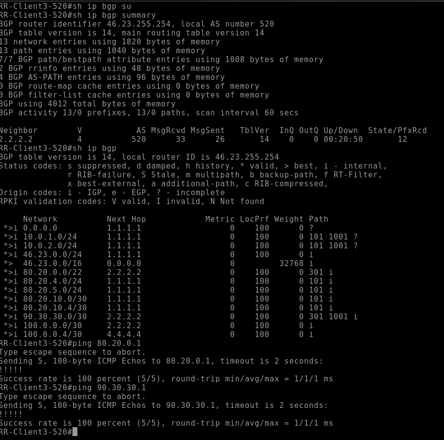
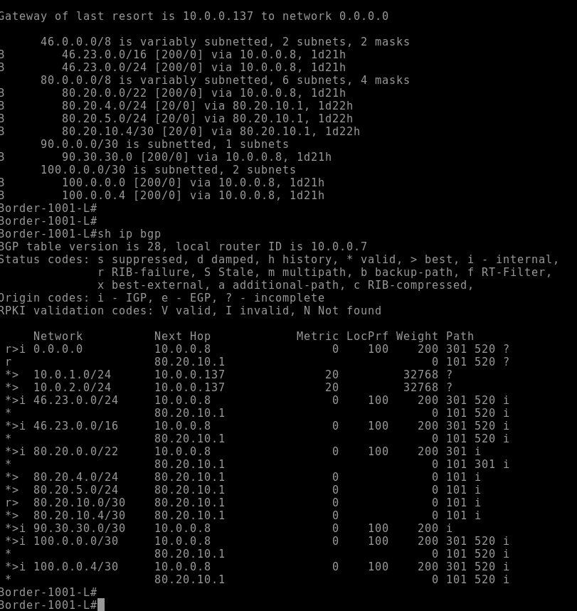
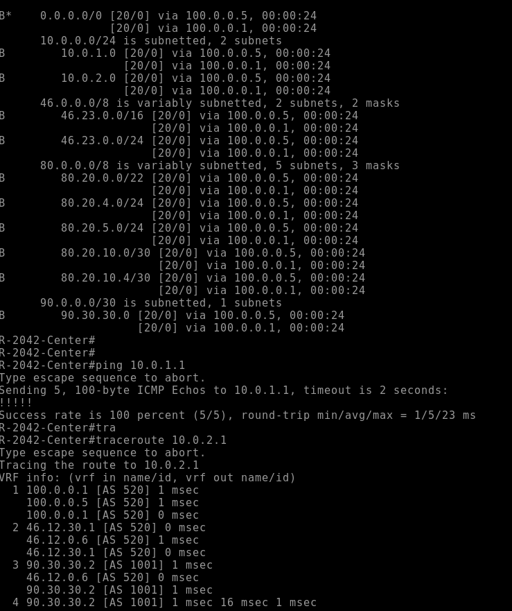

# Настройка iBGP
## По ТЗ нужно настроить iBGP внутри AS
### Начем с настройки RR в ISP Триада
#### В первую очередь выберем маршрутизатор, который будет RR-server
#### В нашем случае им будет выступать R24
```
neighbor AS520 peer-group
 neighbor AS520 remote-as 520
 neighbor AS520 update-source Loopback0
 neighbor AS520 route-reflector-client
 neighbor AS520 next-hop-self
 neighbor 1.1.1.1 peer-group AS520
 neighbor 3.3.3.3 peer-group AS520
 neighbor 4.4.4.4 peer-group AS520
```
#### Т.к. у нас уже есть IP связанность внутри AS, iBGP будем строить на Loobpack интерфейсах и для упрощения понимания конфига создал Peer-Group, в которую добавлены наши соседи. 
#### В настройках Peer-Group указываем, что AS наша, строится на Loobpack интерефесах, наши соседи это RR-client, далее добавляем самих клиентов.
#### На клиентах указываем только одного соседа - RR-server
#### Пример с R25
```
router bgp 520
 bgp log-neighbor-changes
 network 46.23.0.0 mask 255.255.0.0
 neighbor 2.2.2.2 remote-as 520
 neighbor 2.2.2.2 update-source Loopback0
 neighbor 2.2.2.2 next-hop-self
```
#### Проверим сосдество, а также маршруты, полученные от RR-server в другие AS

### Вернемся к офису в Москве
#### Настройки iBGP здесь тоже стандартные, однако нам необходимо сделать так, что приоритететным провайдером стал Ламас
#### Для этого на R14 мы повесим Weight на нашего iBGP соседа, что маршурты в сторону Ламас стали более приоритетными
```
router bgp 1001
 bgp log-neighbor-changes
 neighbor 10.0.0.8 remote-as 1001
 neighbor 10.0.0.8 update-source Loopback0
 neighbor 80.20.10.1 remote-as 101
 !
 address-family ipv4
  redistribute ospf 1 route-map bgp-net
  neighbor 10.0.0.8 activate
  neighbor 10.0.0.8 next-hop-self
  neighbor 10.0.0.8 weight 200
  neighbor 80.20.10.1 activate
 exit-address-family
route-map bgp-net permit 5
 match ip address prefix-list /24
 ```
 #### Перезапустим процесс BGP в "мягком" режиме ```clear ip bgp * soft ``` и проверим таблицу маршрутизации
 
 #### Отлично, теперь маршруты полученные от iBGP соседа имеют приоритет выше, чем полученные от eBGP, кроме тех, которые непосредственно находятся за AS 101
 ### Далее перейдем к Санкт-Петербургу и настроил балансировку между провайдерами
 #### Для этого добавим в конфигурацию BGP ```maximum path 2``` в секции ``` address-family ipv4 unicast ```, а также включим балансировку по destanation ```ip cef```
 #### Проверим нашу работоспособность нашей конфигурации
 
### Итак, мы настроили BGP и добились связанности на всех промежутках.