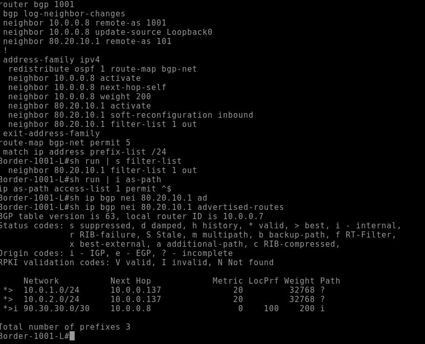
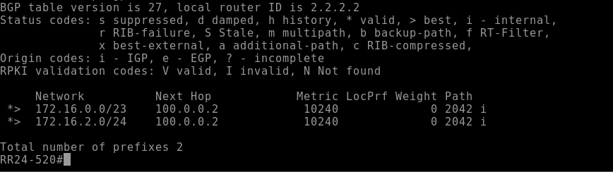
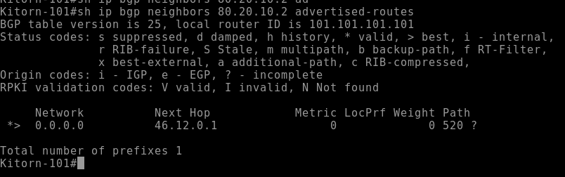
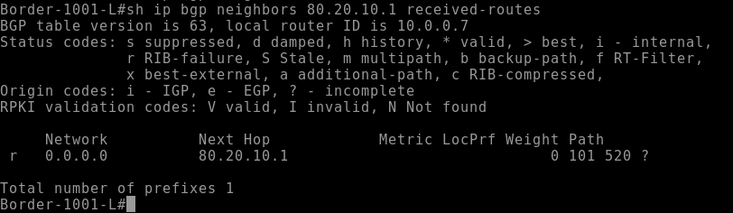
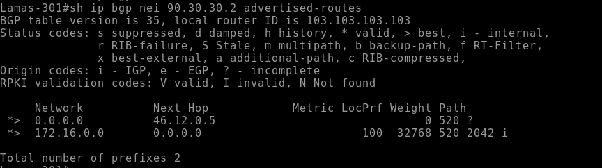
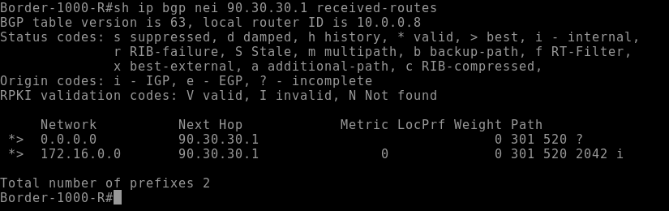
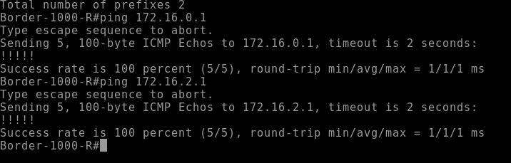
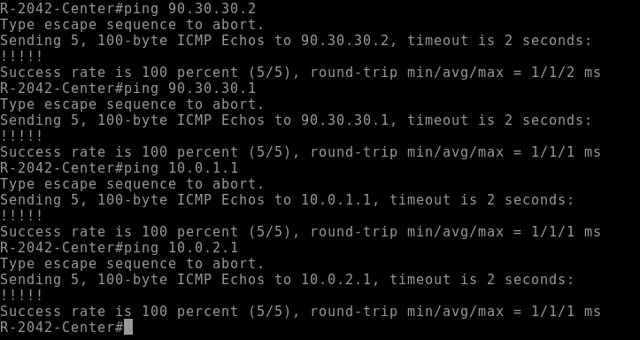

# Лабораторная работу по фильтрации маршрутной информации
## Задача 1: Настроить фильтрацию для офисов в Мосвке и Санкт-Петербурге так, чтобы они не были транзитными
### В Москве настроим filter-list так, чтобы мы анонсировали только свои подсети и не передавили другие. Для этого напишем ```as-path access-list```
```
ip as-path access-list 1 permit ^$ # Регулярное выржение, отсекающее другие AS из анонсов
---
neighbour 80.20.10.1 soft-reconfiguration inbound
neighbour 80.20.10.1 filter-list 1 out
```
#### С помощью ```soft-reconfiguration inbound``` мы сможем автоматически перезапрашивать маршруты без ```clear ip bgp <x.x.x.x>```, а также позволяет смотреть, что мы отдаем соседу и что получаем от него (таблицы ADJ-RIB-IN, ADJ-RIB-OUT). Посдедней командой мы повесили filter-list на отдаваемую маршуртную информацию соседу. 
#### Повтрорим эти манимапуляции на второй Border маршрутизаторе
#### Посмотрим, что мы анонсируем соседу

#### Аналогичную информаицю увидем на втором бордере

### Перейдем в филиал в Санкт-Петербугре
#### Здесь сделаем по сути аналогичные действия только с использованием prefix-list
#### Конфигурация будет выглядеть следующим образом
``` ip prefix-list OUT permit 172.16.0.0/16 ge 23 ```
#### Этим префикс листом мы обозначили сети, которые анонсируем
``` 
neighbour 100.0.0.1 prefix-list OUT out 
neighbour 100.0.0.5 prefix-list OUT out
```
#### Проверим, что все работает корректно

#### Отлично, перейдем к задаче 2
##### P.S. как оказалось, что с префикс листами есть интересная особенность, если в BGP объявлена вся сеть целиком вручную, например 172.16.0.0/16,то этот префикс-лист не работает. Надо бы будет перепроверить это....
### Задача 2: Настроить Киторн так, чтобы в Москву отадвался только дефолт, а на провайдере Ламас должен отдаваться дефолт и маршрут до СПБ.
#### Перейдем к настройкам:
### Киторн
```
ip prefix-list DEFAULT seq 5 permit 0.0.0.0/0
---
neighbor 80.20.10.2 prefix-list DEFAULT out
```
#### Проверим, что все корректно

#### Москва


### Ламас 
#### Тут мы хотим не просто отдавать дефолт, а также суммаризировать маршурт до СПБ. Попробуем настроить
```
neighbour 90.30.30.2 route-map MSK out
aggregate-address 172.16.0.0 255.255.0.0 as-set summary-only route-map MSK
----
ip prefix-list MSK seq 1 permit 0.0.0.0/0
ip prefix-list MSK seq 2 permit 172.16.0.0/16
```
#### Проверим коррекность
### Ламас

### Москва


### А теперь убедимся, что мы не нарушили IP связанность
#### Запустим ping с Москвы

#### А теперь с СПБ до Москвы

### Отлично, мы все настроили и не нарушили работы сети