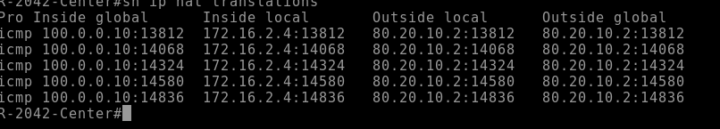
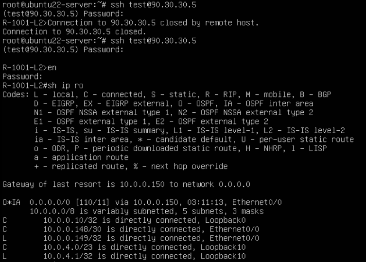

# Лабораторная работа по настройке NAT
## Задача 1. Настроить NAT в Москве на маршрутизаторах R14 и R15
### Этот NAT уже был ранее настроен, проверим, что все работает
#### Запустим ping с хоста

#### Проверим на маршрктизаторе R15

#### Да, все работает корректно
#### Приведу пример настроек

## Задача 2. Настроить Dynamic NAT в СПБ (транслировать в 5 адресов)
### Допустим, что провайдер выдал нам пул 100.0.0.8/29, в который мы можем транслировать наши сети
### Для начала определяем внутренние и внешние интерфейсы
### Создаем список с IP источника и IP адресов для транслирования
```
int ra e0/0-1
    ip nat inside
int ra e0/2-3
    ip nat outside
ip nat pool lol 100.0.0.10 100.0.0.14 netmask 255.255.255.248
access-list 10 permit 172.16.1.0 0.0.0.255
access-list 10 permit 172.16.2.0 0.0.0.255
ip nat inside source list 10 pool lol overload
```
#### Однако этого будет недостаточно, потому что никто не знает куда возвращать трафик, пришедший с этих адресов. Поэтому создаем loopback интерфейс и заводим на нем нашу сеть с маской, которую анонсируем в BGP
```
interface Loopback 1
    ip address 100.0.0.9 255.255.255.248
---
router bgp 2042
address-family ipv4
    network 100.0.0.8 netmask 255.255.255.248
```
#### Поклирим "мягко" соседство BGP и проверим, что там у провайдера

#### Отлично, сеть есть. Попробуем пинг с хоста

#### Проверим трансляцию

##### P.S. пытался нагрузить, чтобы увидеть как он подставит другие адреса из пула, но он упорно натил в один адрес. Мб мало обращений все таки
## Задача 3. Настроить статический NAT для R20
### Ничего сложного. Указываем интерфейс e0/3 как  ```ip nat inside``` затем деляем прямую трансляцию ``` ip nat inside source static 10.0.0.146 90.30.30.5```
#### P.S. если натировать в интерфейс или адрес интерфейса, то ломается BGP сессия

## Задача 4. Опубликовать роутер для управления
### Для начала настроить ssh server на маршрутизаторе R19
```
username test privilege 15 secret <123>
enable secret <123>
aaa new-model
aaa authentification login default local enable
ip domain name r19.local
crypto key generate rsa modulus 1024
line vty 0 4
    transport input ssh
    login authentification default
ip ssh version 2
ip ssh source-interface lo10
```
#### Далее перейдем на маршрутизатор R15 и настроим NAT 
``` ip nat inside source static tcp 10.0.4.1 22 90.30.30.5 22 ```
#### Проверим, что ssh работает из удаленной сети. Для этого я завел Linux сервер в Чокудрах, предварительно настроив NAT. Также внесены параметры в .ssh/config т.к. образы старые и используют устаревшие методы

#### Проверим на R15

#### Ранее забыл упомянуть, что это адрес нужно завести в Loopback и сделать анонс BGP
## Задача 5. Настройка NAT в Чокудрах
### Действуем по той же аналогии, создаем Loopback с публичным адресом, который указываем для NAT. Т.к. тут у нас работает IGP, анонсируем ему в ISIS

#### На роутерах провайдера делаем анонс этого адреса в BGP, чтобы все точно знали куда слать трафик
#### Проверим на Ламас

### Задача 6 и 7. DHCP уже настраивали ранее в другой лабе.
#### Настроим NTP на сервере. В качестве IP указываем себя
```
ntp master 1
ntp server 10.0.0.7
```
#### Перейдем к клиенту
```
ntp server 10.0.0.7
ntp peer 10.0.0.8 # Второй сервер
```
#### Проверим корреткность

