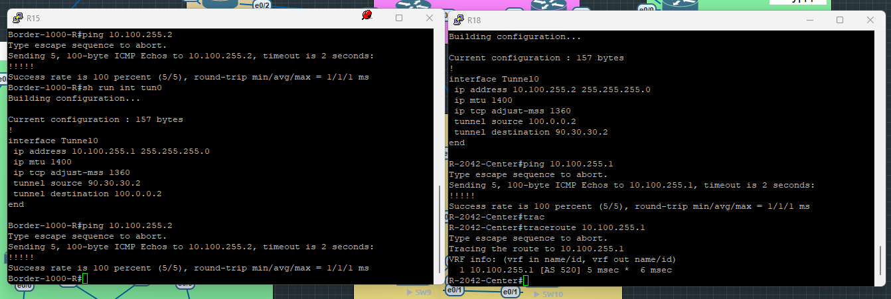
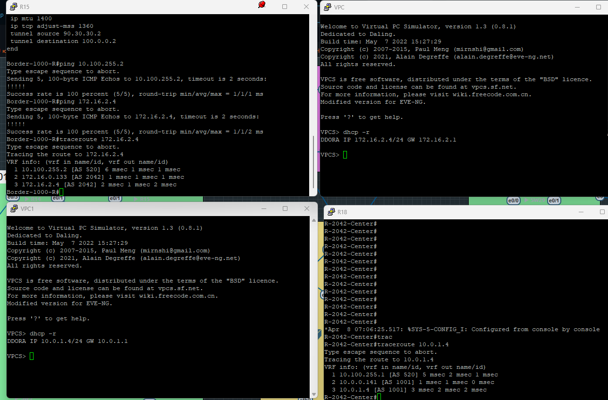
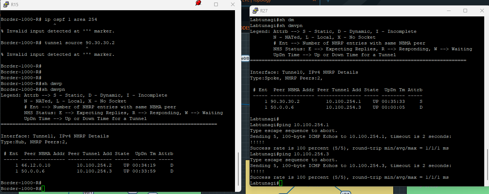
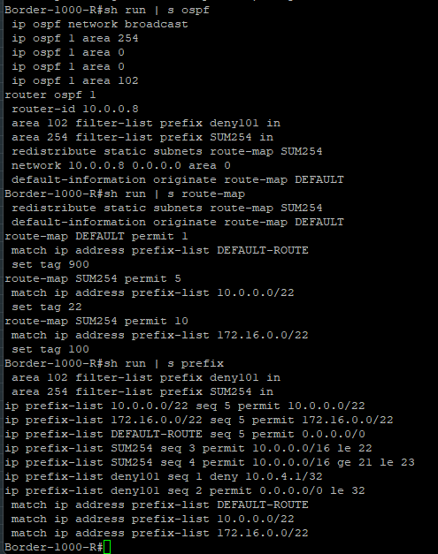
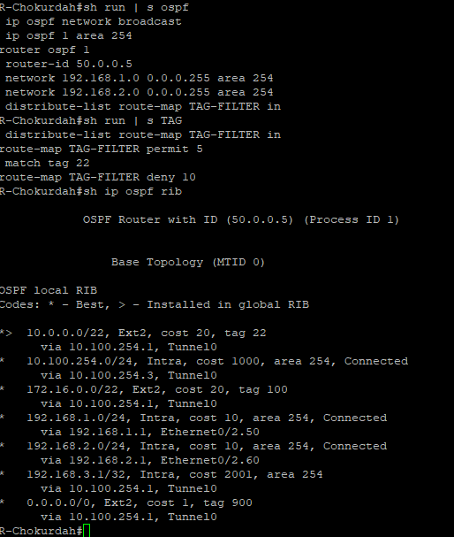
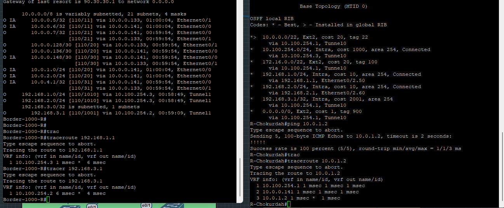

# Лабораторная работа по настройке GRE и базового DMVPN
## Задача 1: Настроить GRE туннель между офисами в Москве и Санкт-Петербурге
### Настройка GRE
#### "Чистый" GRE делается очень просто для этого с обеих сторон поднимаем туннель и указываем в качестве пира - соседа
#### Конфигурация устройств (R15 и R18)
##### R15
```
interface Tunnel0
 ip address 10.100.255.1 255.255.255.0 
 ip mtu 1400 
 ip tcp adjust-mss 1360
 tunnel source 90.30.30.2
 tunnel destination 100.0.0.2
```
##### R18
```
interface Tunnel0
 ip address 10.100.255.2 255.255.255.0 
 ip mtu 1400 
 ip tcp adjust-mss 1360
 tunnel source 100.0.0.2
 tunnel destination 90.30.30.2
```
##### -- Указываем адрес туннельного интерфейса;
##### -- Уменьшаем MTU, чтоб пакет после добавления заголовкой "пролез" в физический интерфейс
##### -- Снижаем MSS для сегмента TCP 
##### -- Указываем конкртый белый адрес, который будет выступать в качестве источника для туннелируемого трафика
##### -- Указываем назанчение нашего туннеля

#### По сути GRE уже поднят, можем проверить IP связанность по туннельным адресам

#### Так как маршурты до подсетей анонсируются по BGP, трафик пойдет в обход туннеля, поэтому временно добавим простые статически маршруты для проверки конктреного этого туннеля и проверим связанность подсетей


## Задача 2: Настроить DMVPN для Чокурдах и Лабытнаги
### Настройка DMVPN
#### Для взаимодействия филиалов настроим вторую фазу DMVPN для связанности филиалов
#### Конфигурация Москвы
```
interface Tunnel1
 ip address 10.100.254.1 255.255.255.0
 no ip redirects
 ip mtu 1400
 ip nhrp map multicast dynamic
 ip nhrp network-id 254
 ip tcp adjust-mss 1360
 ip ospf network broadcast
 ip ospf 1 area 254
 tunnel source 90.30.30.2
 tunnel mode gre multipoint
```
#### В случае HUB мы убираем настройку назанчения туннеля и добавялем nhrp для работы, где сначала указывем id сети, а также составляем динамическую карту. Последним действим явно указываем, что режим туннеля multipoint
#### Конфигурация филиалов
#### R27 
```
interface Tunnel0
 ip address 10.100.254.2 255.255.255.0
 no ip redirects
 ip mtu 1400
 ip nhrp map multicast 90.30.30.2
 ip nhrp map 10.100.254.1 90.30.30.2
 ip nhrp network-id 254
 ip nhrp nhs 10.100.254.1
 ip tcp adjust-mss 1360
 ip ospf network broadcast
 ip ospf 1 area 254
 tunnel source 46.12.0.10
 tunnel mode gre multipoint
end

```
#### В режмие Spoke, мы указываем только IP HUB (внешний и внутренний), а затем в карте связываем их друг с другом
#### Проверка связанности

### Настройка OSPF в DMVPN
#### Приступим к самому интересному - настройке OSPF
### Небольшое предисловие
#### Если просто поднять OSPF в туннеле, то сталкиваемся с проблемой, что на Чокурдах нам приходит дефолт, анонсированный на R15 для внутренней маршщрутизации. Также обычные фильтры ```area X filter-list prefix XXXX in``` , то мы фильтруем только маршруты IntraArea (LSA3), но маршруты, которые редистрибьютились (LSA 5) из других протоколов не попадают в данный фильтр и сталкиваемся с интерсной проблемой, когда в филиале Чокурадах у нас ставится дефолт через туннель, который ломает выход в Интернет и постоянно падающий и встающий OSPF.
#### Во избежании этой проблемы мы будем тегировать маршруты, а на филиалах будем фильтровать теги. Приступим
### Настройка OSPF и Route-Map
#### Сначала настроим HUB для тегирования маршрутов
#### Тегирование маршрутов

#### Проводим настройку в филиалах

#### Проверка связанности
