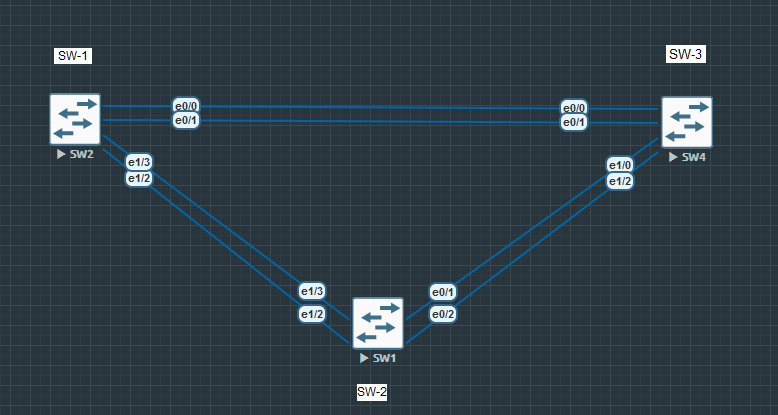
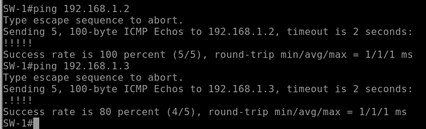
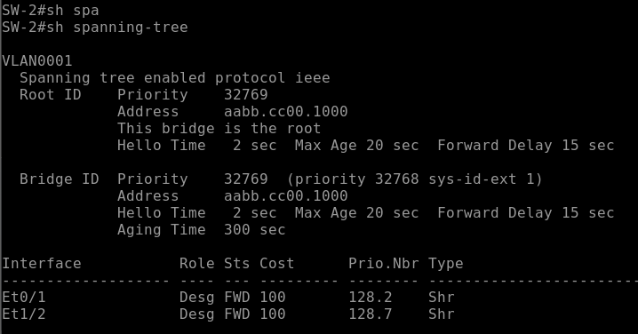
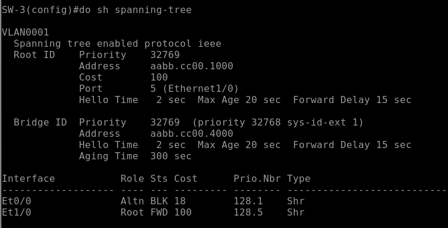
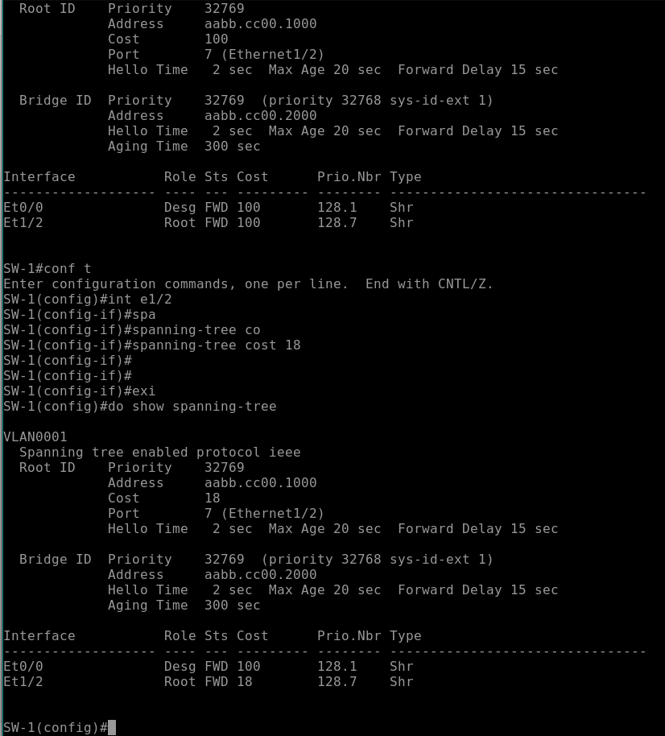
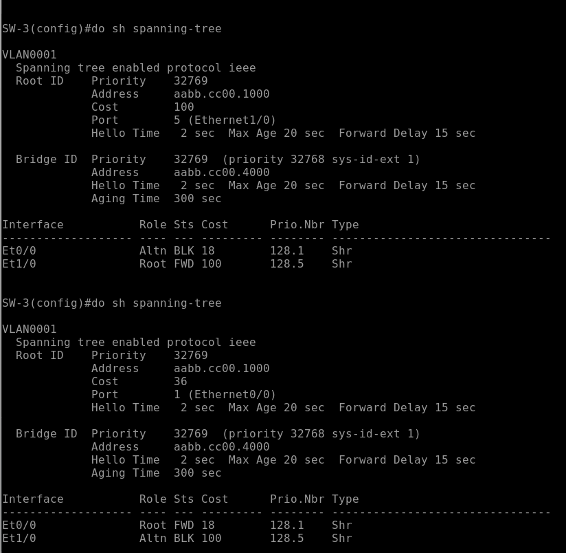
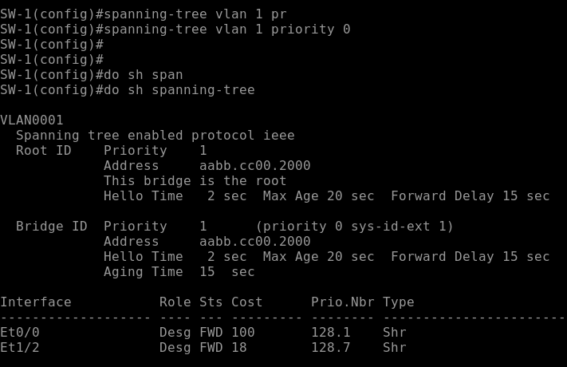
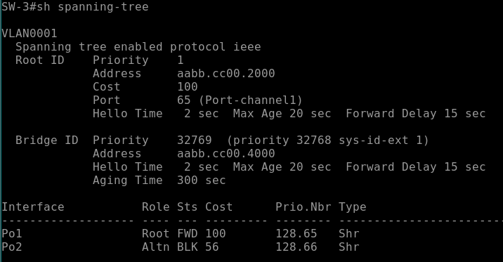
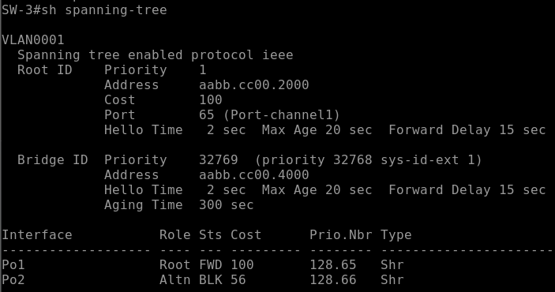

# Lab 2 STP
## Topology


### PART 1
#### Базовая настройка коммутаторов (настройки идентичны на всех коммутаторов кроме ip адерсов и hostname)

```
no ip domain-lookup
hostname SW-{1-3} #### В зависимости от коммутатора выбираем один из hostname
enable secret class
line console 0
password cisco
login
logging synchronous
line vty 0 4
password cisco
login
banner motd ^CAuthentification is nessesary^C
interface vlan 1
ip address 192.168.1.{1-3} 255.255.255.0 ### В зависимости от коммутатора выбираем один из ip address
copy running-config startup-config
```
#### Проверка ip связанности

Аналогичный результат получаем со всех коммутаторов

### PART 2
#### Отключение избыточных портов и нахождение корневого коммутатора
``` 
SW-1# int range e0/2-3
SW-1# sh
SW-1# int e0/0
SW-1# sh
SW-1# int range e1/0-1
SW-1# sh
SW-1# int e1/3
SW-1# sh
```
Аналогичным образом отключаем на других порты коммутаторах
В итоге получаем влюченные порты:    
SW-1 -- e0/0 ; e1/2     
SW-2 -- e0/1 ; e1/2     
SW-3 -- e0/0 ; e1/0

#### Находим корневой коммутатор
Корневым коммутатором в нашей топологии будет коммутатор SW-2 т.к. у всех у коммутаторов не было вручную выбран приориетет, поэтому выборы прошли исходя из наименьшего MAC адреса


Корневым портом у коммутатора SW-1 будет e1/2
Корневым портом у коммутатора SW-3 будет e1/0

У Root (SW-2) назначенными будут все порты
У SW-1 назначенным будет e0/0
У SW-3 альтернативный порт будет e0/0 т.к. суммарная стоимость до root будет 200, что естесствно меньше чем добраться напрямую за 100

#### Меняем приоритеты портов коммутаторов
Изменем стоимость порта e0/0 у SW-3 на значение 18
``` spanning-tree cost 18 ```
что вызывает пересчет топологии у коммутаторов, но суммарная стоимость пути до корневого коммутатора все равно больше чем добраться напрямую


##### Теперь сменим стоимость порта e1/2 у SW-1 на 18   


##### Пересчет топологии для SW-1 не затронул статус портов, но теперь посмотрим, что у SW-3  


##### Наблюдаем картину, что порты поменялись ролями потому что теперь до корневого коммуатора дешевле добраться через SW-1

### Исследование влияния Port-Channel на топологию STP
Для эксперемента попробуем самостоятельно задать корневой мост и собрать LACP между коммутаторами. Корневым коммутатором теперь пусть будет SW-1
``` spanning-tree vlan 1 priority 0 ```

#### Теперь включим избыточные порты между коммутаторами и соберем LACP



Теперь избыточные интерфейсы между коммутаторами воспринимаются как один логический, поэтому два интерфейса, подключенных к одному коммутатору не вызывают петлю    


