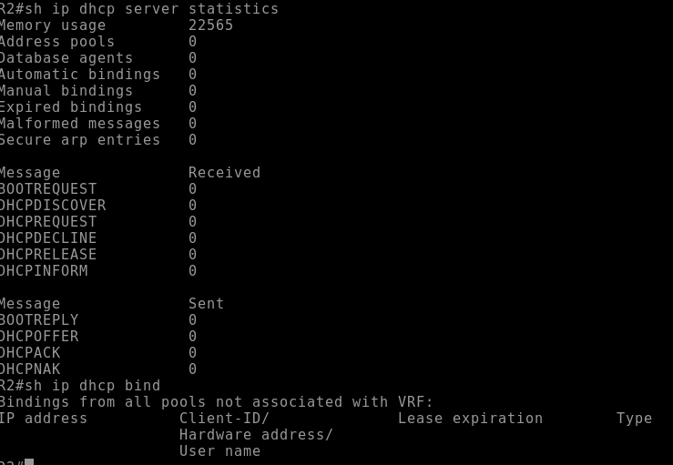

# lab 3
## DHCPv4


### Part 1
#### Распределение адресного пространства
#### Подсеть А -- 192.168.1.0-63 255.255.255.192
#### Подсеть В -- 192.168.1.64-95 255.255.255.224
#### Подсеть С -- 192.168.1.96-111 255.255.255.240

#### Базовая настройка маршрутизторов 
```
hostname R{1-2}
no domain ip lookup
enable secret class
line console 0
password cisco
login
line vty 0 4
transport input ssh
password cisco
login
service password-encryption
banner motd ^CUnauthorized access is prohibited^C
copy running-config startup-config
clock set MSK 12 12
```
#### Настройка подинтерфейсов маршрутизатора R1

```
interface Ethernet0/1.100
 description Client-network-R1
 encapsulation dot1Q 100
 ip address 192.168.1.1 255.255.255.192
 !
interface Ethernet0/1.200
 description Managment
 encapsulation dot1Q 200
 ip address 192.168.1.65 255.255.255.224
!
interface Ethernet0/1.1000
 encapsulation dot1Q 1000 native
!
interface Ethernet0/2
 ip address 10.0.0.1 255.255.255.252
```
#### Настройка интерфейсов маршрутизатора R2

```
interface Ethernet0/1
 description network C
 ip address 192.168.1.97 255.255.255.240
 ip helper-address 192.168.1.1
!
interface Ethernet0/2
 ip address 10.0.0.2 255.255.255.252
!
ip route 0.0.0.0 0.0.0.0 10.0.0.1
```
#### Базовая настройка коммутатора
```
hostname S{1-2}
no domain ip lookup
enable secret class
line console 0
password cisco
login
line vty 0 4
transport input ssh
password cisco
login
service password-encryption
banner motd ^CUnauthorized access is prohibited^C
copy running-config startup-config
clock set MSK 12 12
```
#### Настройка VLAN на коммутаторах

```
hostname S1
interface Ethernet0/0
 switchport access vlan 100
 switchport mode access
!         
interface Ethernet0/1
 switchport trunk allowed vlan 100,200,1000
 switchport trunk encapsulation dot1q
 switchport trunk native vlan 1000
 switchport mode trunk
!         
interface Ethernet0/2
 shutdown
!         
interface Ethernet0/3
 shutdown
!         
interface Vlan200
 ip address 192.168.1.66 255.255.255.224
!         
ip default-gateway 192.168.1.65
```
```
hostname S2
interface Ethernet0/0
!         
interface Ethernet0/1
 switchport trunk encapsulation dot1q
 switchport mode trunk
!         
interface Ethernet0/2
 shutdown
!         
interface Ethernet0/3
 shutdown
!         
interface Vlan1
 ip address 192.168.1.98 255.255.255.240
!         
ip default-gateway 192.168.1.97
```

### Part 2

#### Настройка пула адресов и relay на маршрутизаторах
##### R1
```
ip dhcp excluded-address 192.168.1.1 192.168.1.5
ip dhcp excluded-address 192.168.1.97
!
ip dhcp pool NET-A
 network 192.168.1.0 255.255.255.192
 default-router 192.168.1.1 
 domain-name ccna-lab.com
 lease 2 12 30
!
ip dhcp pool R2-Client-LAN
 network 192.168.1.96 255.255.255.240
 domain-name ccna-lab.com
 default-router 192.168.1.97 
 lease 2 12 30
 ```

 #### R2
 ``` ip helper-address 192.168.1.1 ```

 
 

#### Проверка работы DHCP на PC-A и PC-B

