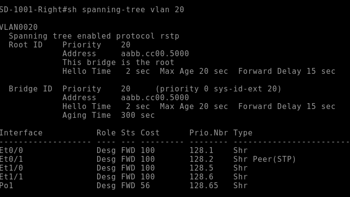
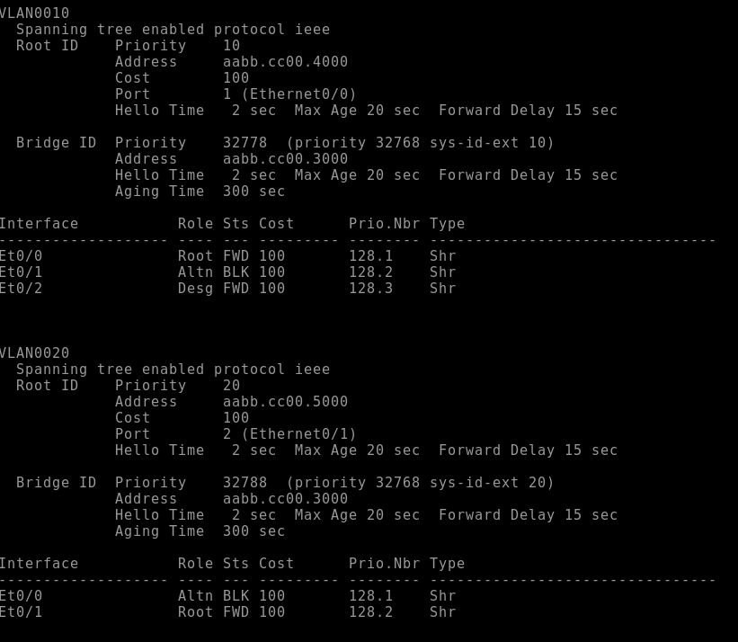

# Архитекутра и адресоное пространство сети

## Адресное пространоство будет поделено следующим образом:
### AS 1001 net 10.0.0.0/16
### AS 2042 net 172.16.0.0/16
### Чокурдах и Лабытнаги net 192.168.0.0/22

## AS 101, AS 301, AS 520 будут проовайдерские сети, у которых адресация будет по публичным адресам
### AS 101 net 80.20.10.0/23
### AS 301 net 90.30.30.0/23
### AS 520 net 46.12.0.0/19

## Сеть AS 1001
#### Адерсация в сети

#### P2P соединения

### Комутация в сети AS 1001
#### В ЛВС SW5 является root switch для VLAN 20

#### Для VLAN 10 root SW4

#### При такой конфигурации STP работает эффективно т.к. неоптимальные линки до корневого SW заблокированы

#### ПК внутри сети получают адреса по DHCP. Хосты из разных VLAN могут пинговать друг друга

## Сеть AS 2042
#### Адресация в AS 2042

#### P2P соединения в сети

### На маршрутизаторах ядра настроен HSRP перекрестным образом, поэтому в случае падения одного из коммутаторов сеть продолжит функционировать

## Сеть Чокудрах и Лабытнаги

