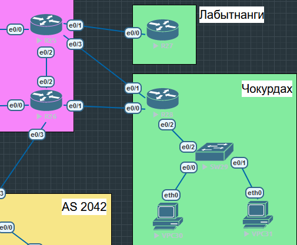
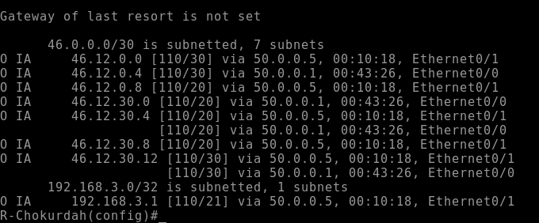
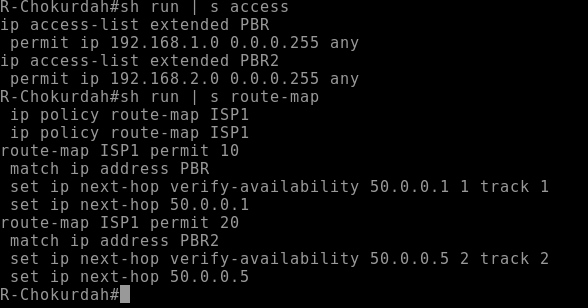
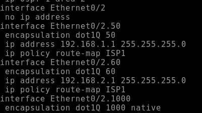
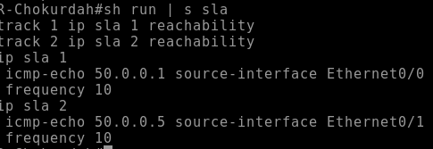
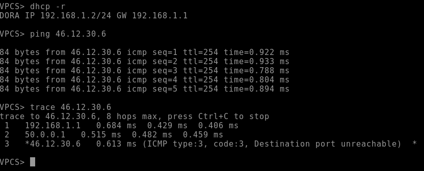
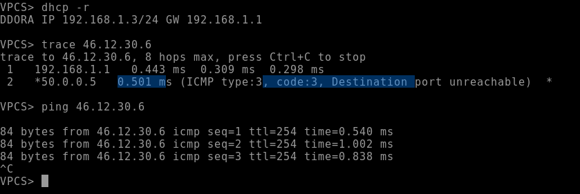
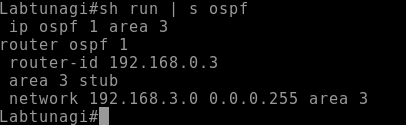
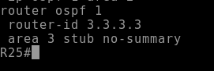
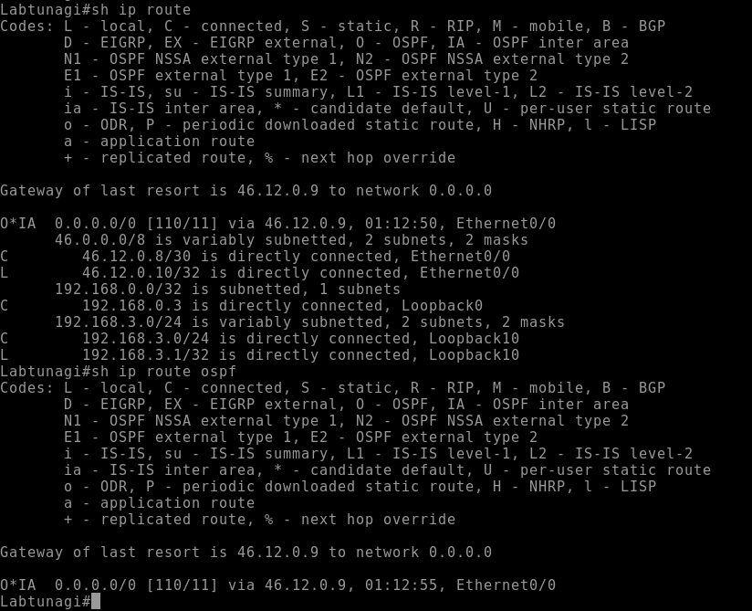

# Настройка PBR в связке с IP SLA
## Топология

## Для настройки будем использвоать следующую логику:
#### На R28 запущен процесс OSPF со стандартной зоной, в которую приходят маршруты от провайдера

#### Мы хотим настроить балансировку между провайдерами, распределять трафик будем в зависимости от подсети источника, а именно: сеть 192.168.1.0 будет идти через e0/0, а сеть 192.168.2.0 через e0/1.
#### Для этого создадим access-list для обеих подсетей, а также route-map, где укажем условия для трафика и "повесим" PBR на интерфейсы откуда ожидаем трафик, а именно саб-интерфейсы e0/2

#### Для отслеживания доступности  канала создадим правила ip sla и изменим правила PBR

## Проверка работоспобности
#### Проверим работы на ПК из подсети 192.168.1.0

#### Трафик идет так как и запланировано. Теперь сломаем линк и проверим, что маршрут трафика изменится

#### Как видим трафик сменил маршрут

## Маршрут по умолчанию на R27
#### На R27 настроем totally-stub зону для получения только маршрута по умолчанию
#### Для этого укажем на R27, что зона 3 будет stub

#### А на R25 укажем, что в area 3 нужно отдавать только default

#### Проверка
