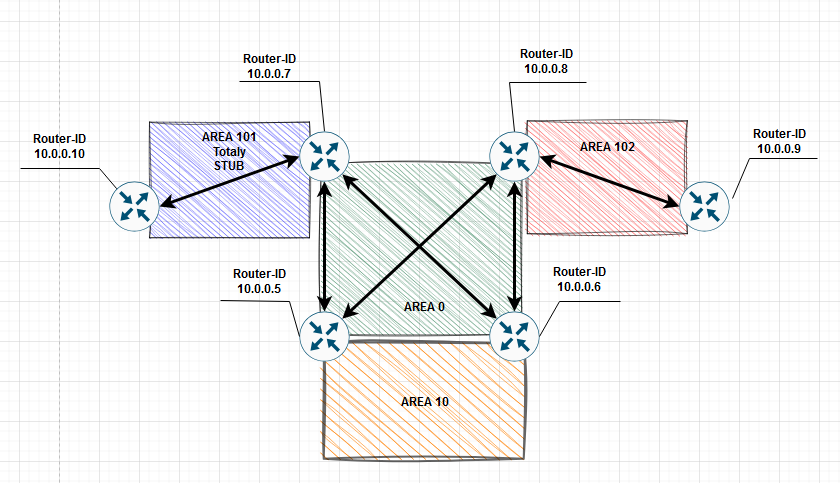
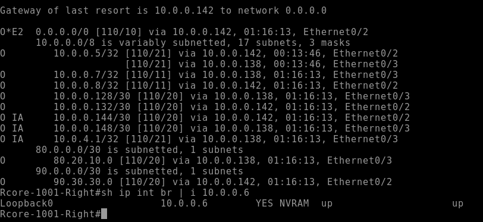
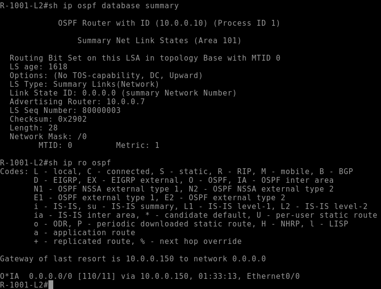
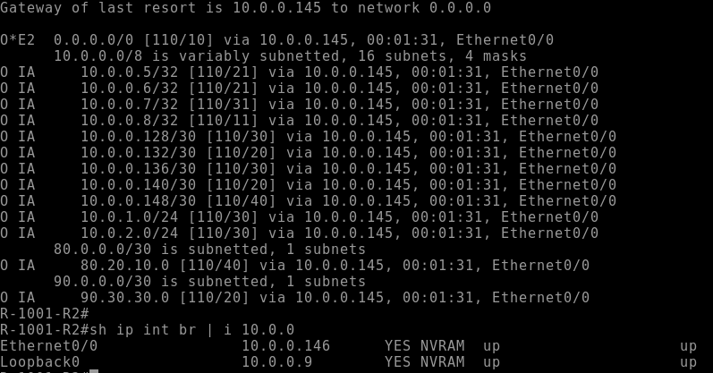
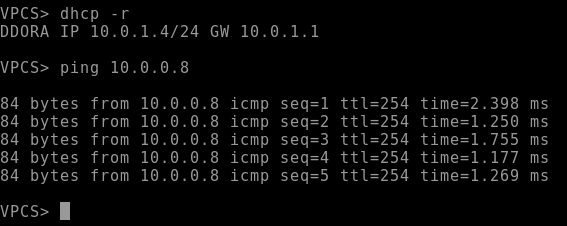

# Лабораторная работа по OSPF

### Исходя из ТЗ, расположим зоны по схеме ниже


#### 1. Сначала настроим зону backbone на маршрутизаторах
##### В качетсве примера взяты настройки с R14
```
router ospf 1 # Запускаем процесс OSPF
router-id 10.0.0.7 # Указываем явный Router-ID с Loopback интерфейса
network 10.0.0.7 0.0.0.0 area 0 # Явно ананосируем нужные сети в зону 0
network 80.20.10.0 0.0.1.255 area 0 

inetraface range e0/0-1 # Указываем диапозон портов в нужной зоне
ip ospf 1 area 0 # Явно включаем их в зону 0
```
##### На маршрутизаторах с R-ID 10.0.0.5-8 настройки будут идентичины за исключением анонсируемых сетей и портов, где стоит указана зона 0

#### 2. Настроим зону 10 на маршрутизаторах с ID 10.0.0.5-6
```
network 10.0.0.0 0.0.0.255 area 10 # Анонсируем зону сеть в зону 10
```
#### На маршрутизаторе 10.0.0.8 анонсируем default
``` 
default-inforamtiion originate
```
#### Проверим таблицу маршрутизации на 10.0.0.6


#### 3. Настроим Totally STUB зону на 10.0.0.10 (для получения ТОЛЬКО маршрута по умолчанию)
```
router ospf 1 
router-id 10.0.0.10
area 101 stub # Указываем, что зона 101 является stub
network 10.0.4.0 0.0.1.255 area 101
```
##### На 10.0.0.7 указываем следующие настройки
```
area 101 stub no-summary # Указываем, что в зону 101 отправляем только дефолт
interface e0/3
ip ospf 1 area 101
```
##### Проверим базу OSPF на 10.0.0.10


#### 4. Настроим зону 102 на R20 с prefix-list на R15
##### Настроим prefix-list на 10.0.0.8
```
ip prefix-list deny101 seq 1 deny 10.0.4.0/24 # Создаем prefix-list с запретом сети 10.0.4.0/24
ip prefix-list seq 2 permit 0.0.0.0/0 le 32 # Разрешаем анонс для всех остальных сетей

area 102 filter-list prefix deny101 in # Привязываем prefix-list к зоне 102

interface e0/3
ip ospf 1 area 102
```
##### Проверим таблицу маршрутизации


##### Для проверки IP связанности запустим ping с VPC1 до R15 (10.0.0.8)

