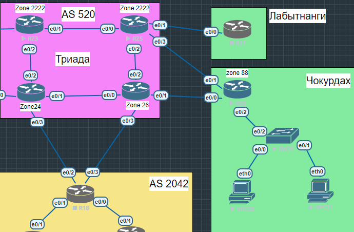
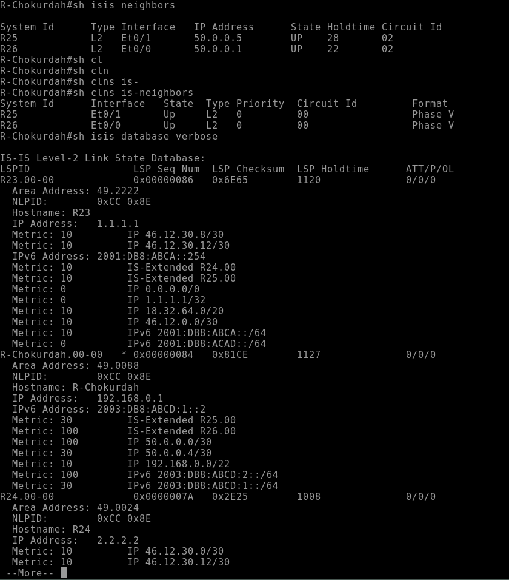

# Лабораторная работа по IS-IS
## ТЗ и описание топологии
### Задача: настроить IS-IS в ISP Триада, где R23 и R25 будут находится в одной зоне 2222, а маршрутизаторы R24 и R26 в своих отдельных зонах.
### Для проверки работоспособности в данную топологию будет включен R28 (Чокудрах), который будет также в своей зоне.

#### Начнем с настройки зоны 2222. Начальные настройки для обоих маршуртизаторов будут идентичные.
```
router isis 2222
net 49.2222.3333.0000.0002.00
metric-style wide # Указываем расширенный вариант метрики
passive interface Loopback0 # Указываем Loopback интерфейсы, имитирующие сторонние сети
passive interface Ethernet0/X # В данном случае указываем интерфейс, который хотим анонсировать в ISIS, но не рассылать Hello сообщения
address-familiy ipv6
    redistribute connected
```
#### Настройки на интерфейсах
```
ip router isis 2222
ipv6 router isis 2222 
isis circuit-type level-2-only
isis network point-to-point
no isis hello padding
```
#### В данной конфигурации мы включаем IS-IS на интерфейсах, явно указываем тип соседства, тип сети и отключаем заполнение кадров "водой" для того, чтобы не терять пропускную способность канала

#### Маршрутизатор R23 мы будем считать выходом в Интернет, поэтому заведем на нем маршрут в Null0 и будем отдавать его соседям через `default-information originate`

#### Пример конфига R23


#### Также на нем же будем отдавать IPv6 маршрут, заведенный также на Loopback


#### На остальных маршрутизаторах настройки идентичные, кроме номера зоны и имен интерфейсов
#### Включим ISIS на маршрутизаторе R28 и проверим корректность настроек. Также на этой роутере заведем prefix-list для того, чтобы в нашу таблицу не попадали P2P линки провайдера. По правильному мы должны разграничить отправку этих маршрутов на "отдающем" маршрутизаторе, но из-за особенностей прошивки виртуального роутера мы не можем это сделать.

#### Помимо этого на этом роутере будем создавать суммарный маршурт в наши сети
#### Вывод диагностической информации

#### Для финальной проверки попробуем запустить пинг с PC до R23
