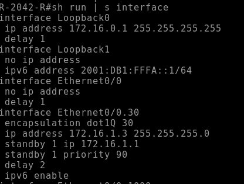
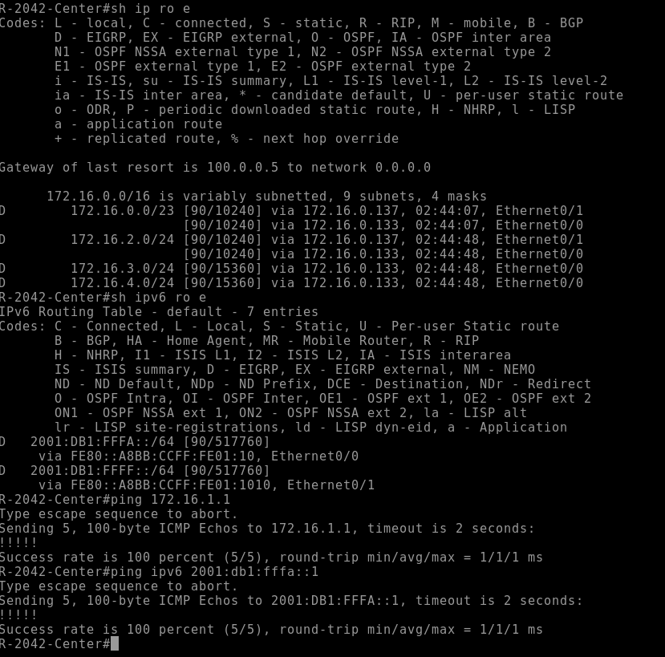
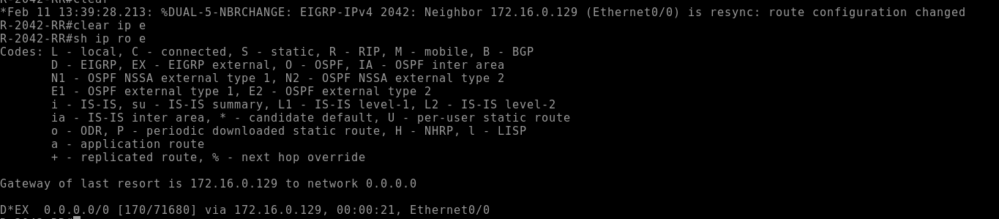

# Лаборатнорная работа по настройке EIGRP
## Задача: настроить EIGRP в филиале в Санкт-Петербурге. Добиться IP-связанности устройств, а маршрутизатор R32 должен получать только маршрут по умолчанию.
### Для начала настроим EIGRP на маршрутизаторах R16-18.
### Ниже приведена конфигурация R18
```
router eigrp DV # Создаем именной экзепляр EIGRP
 !
 address-family ipv4 unicast autonomous-system 2042 # переходим в секцию настройки для IPv4 unicast
  !
  af-interface default # Секция настройки интерефесов
   authentication mode hmac-sha-256 key # Включил аутентификацию на интерфейсах
   add-path 4 # будем отдавать максимальное количество возможных путей
  exit-af-interface
  !
  af-interface Loopback0 # Для Loopback явно укажем, что интерфейс находится в пассивном режмие
   passive-interface
  exit-af-interface
  !
  topology base # Секция настройки тополгии
   variance 2 # Настройка для unequal balance routing. Она оттакливается от минимального значения метрики для маршрута. Если метрика альтернативного маршрута не превышает метрику основного более чем в 2 раза, то альтернативный маршрут установится в RIB и трафик будет балансироваться
   redistribute bgp 2042 route-map def-route # Настройка для редистрибьюции дефолтного маршрута из BGP
  exit-af-topology
  network 172.16.0.0 0.0.0.255 # Проводим анонс сетей
  metric weights 0 0 0 1 0 0 0 # Переопределяем дефолтные параметры для расчета метрики EIGRP. В данной конфигурации будет учитываться только delay интефрейсов. Это поможет визуально упростить различия между маршрутами, а также мы сможем проще управлять ими
  eigrp router-id 172.16.0.6 # Явно указываем свой RID
 exit-address-family
 !        
 address-family ipv6 unicast autonomous-system 2042 # Настройки для IPv6
  !       
  af-interface default
   authentication mode hmac-sha-256 ipv6
   add-path 4
  exit-af-interface
  !       
  topology base
   redistribute connected # В данной настройке будем анонсировать DC интерфейсы
  exit-af-topology
 exit-address-family

route-map def-route permit 10
 match ip address prefix-list 0.0.0.0/0
 set metric 100000 10 255 1 1500 # EIGRP для редистрибьюции требует указать ему новые параметры для расчета метрики

```
### P.S. Для установления сосдетсва крайне важно, чтобы значения metric считались везде одинаково. 
#### На маршрутизаторах R16-17 ключевые настройки EIGRP будут идентичными. В первую очередь это метод расчета метрики, номер AS, а также параметры аутентфикации. 
#### Также переопределим дефолтной значение delay на интерфейсах всех маршрутизаторов. Bandwidth не учитываем т.к. все интерфейсы имеют одинаковую пропускную способность, а визуально они добавляют "мусора" и усложняют понимание метрики

#### Помимо прочего необходимо суммаризировать префиксы для вышестоящего маршрутизатора, поэтому для интерфейса, смотрящего наверх мы указываем как суммаризировать отдававемые сети
``` 
af-interface Ethernet 0/1
    summary-address 172.16.0.0 255.255.254.0
```
#### Данную настройку будем проводить на интерфейсах R16-17, смотрящих в сторону вышестоящего маршрутизатора. После введения настройки удостоверимся, что все работает.
#### Ниже приведена таблица маршрутизации R18


### Перейдем к настройке R32. 
#### Это тупиковый маршрутизатор в нашей топологии, поэтому нет смысла отдавать ему все маршруты и нагружать его RIB. Настроим R16 так, чтобы в строну R32 шел только дефолт.
#### Для этого перейдем в секцию ```topology base``` и укажем настройку
``` distribute-list route-map def out Ethernet0/3 ``` Таким образом мы повесили фильтр на отдаваемые маршруты на интерфейс, где находится нужный сосед. Проверим корректность настройки

#### Да, наша настрйка корректна.
### Итак, мы настройки EIGRP для внутренней маршрутизации. От себя добавлю, что понравился этот протокол. По своему функционалу он показался мне похожим на облегченную версию BGP для IGP

