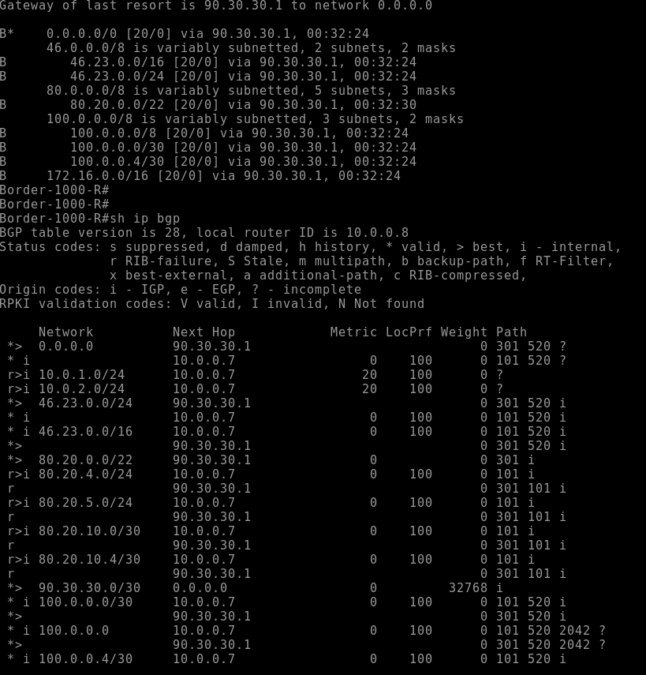
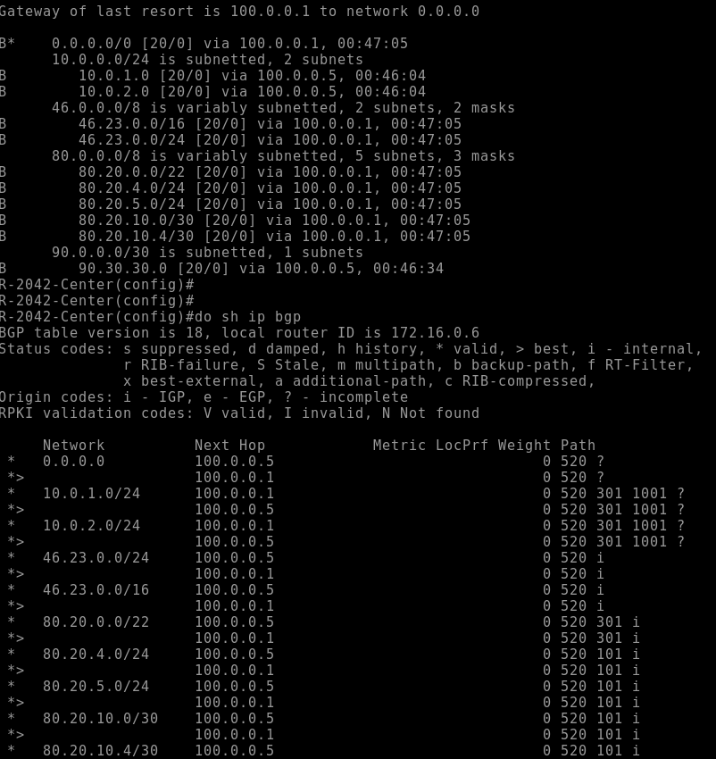
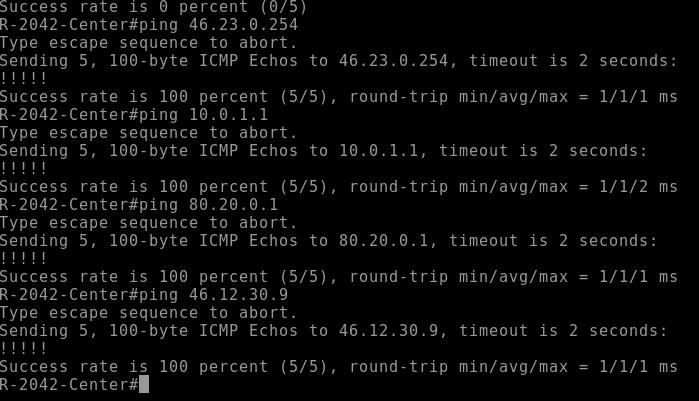

# Лабораторная работа по eBGP
## Задача: настроить eBGP соседство между граничными маршрутизаторами
### Начнем с настройки eBGP между Москвой и ISP
#### Включим процесс BGP на маршрутизаторе R14
```
router bgp 1001
    neighbor 80.20.10.1 remote-as 101 # Указываем соседа из удаленной AS
    neighbor 10.0.0.8 remote-as 1001 # Указываем своего iBGP соседа
    neighbor 10.0.0.8 update-source Loopback0 # Указываем с какого интерфейса будем анонасировать префиксы
    neighbor 10.0.0.8 next-hop self # Говорим, что в качестве next-hop для соседа указывать самого себя
    redistribute ospf 1 route-map bgp-net # Анонсируем сети из OSPF в BGP
route-map bgp-net permit 5 # Мапим пользовательские сети
    match ip address prefix-list /24
ip prefix-list /24 permit 10.0.0.0/8 ge 16 le 24 
```
#### При такой конфигурации мы провели анонсы только нужных сетей в процесс BGP, не указывая стыковочные сети внутри нашей ЛВС. Для того, чтобы наши маршрутизаторы могли пинговать маршрутизаторы из других AS настроим NAT
```
ip nat inside # На внутренние интерфейсы 
ip nat ouside # На внешние интерфейсы
ip access-list 10 permit 10.0.0.0 0.255.255.255
ip nat inside source list 10 interface e0/2 overload 
```
#### В данном случае мы занатировали P2P линки адресом внешнего интерфейса маршрутиазтора. 
#### На маршрутизаторе R15 вносим аналогичные настройки за исключением IP сосдедей

#### Настроим eBGP на маршрутизаторах провайдера Киторн
```
router bgp 101
    bgp router-id 101.101.101.101 
    neighbor 46.12.0.1 remote-as 520
    neighbor 80.20.10.2 remote-as 1001
    neighbor 80.20.10.6 remote-as 301
    network 80.20.4.0 mask 255.255.255.0
    network 80.20.5.0 mask 255.255.255.0
    network 80.20.10.0 mask 255.255.255.252
    network 80.20.10.4 mask 255.255.255.252
```
#### В приведенной выше кофигруации мы указали своих соседей из других AS, а также анонсировали свои сети. Аналогичные действия проводим на Ламас
#### Проверим таблицы маршрутизации на настроенных маршрутизаторах

### Приступим к настройке eBGP для офиса в СПБ
#### на R18 запустим процесс BGP
```
router bgp 2042
    redistribute ospf 1
    neighbor 100.0.0.1 remote-as 520
    neighbor 100.0.0.5 remote-as 520
    auto-summary
router ospf 1
    network 0.0.0.0 255.255.255.255 area 0
    default-information originate
```
#### В данной конфигурации мы не стали делать нат, а просто редистрибутнули сети из ospf и включили авто-суммаризацию, чтоб отдавать один префис в сеть провайдера. В процесс OSPF анонсировали дефолт, чтоб маршрутизаторы знали куда слать трафик.
#### Проверим таблицу BGP 


#### Убедимся в IP связанности

