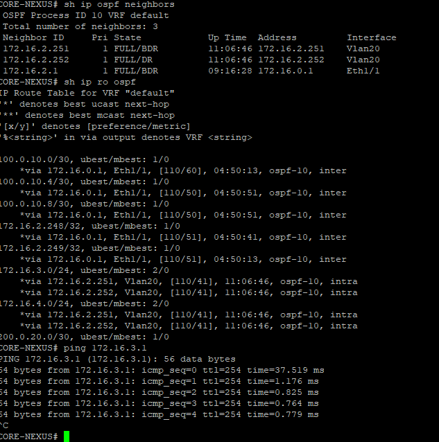

# Проектная работа по курсу
## Топология сети 

### На данном стенде я хочу предомонстрировать свой вариант огранизации корпоративной сети, основываясь на знаниях полученных на курсе.
## Начнем с коммутации
#### Так как большая часть трафика идет по направлению Юг <-> Север, настроим LACP в этом направлени от коммутаторов доступа до ядра сети, представленного в виде Nexus.
#### Начать рассматривать конфигурацию предлагаю с коммутаторов дистрибьюции, на которых заведены VLAN интерфейсы для маршрутизации между нашими подсетями.
#### Пример настроек с SW-D1
```
username mike privilege 15 secret 5 $1$epHU$oyB2id4n7xG9mX0KcQLyN/
aaa new-model
!
!
aaa authentication login default group radius local
aaa authorization exec default group radius local

spanning-tree mode rapid-pvst
spanning-tree extend system-id
spanning-tree vlan 30 priority 0
spanning-tree vlan 40 priority 4096

interface Vlan20
 ip address 172.16.2.251 255.255.255.0
!
interface Vlan30
 ip address 172.16.3.2 255.255.255.0
 standby version 2
 standby 2 ip 172.16.3.1
 standby 2 priority 150
 standby 2 preempt
 standby 2 authentication md5 key-string otus
!
interface Vlan40
 ip address 172.16.4.2 255.255.255.0
 standby version 2
 standby 3 ip 172.16.4.1
 standby 3 authentication md5 key-string otus
!
router ospf 10
 router-id 172.16.2.251
 network 172.16.2.0 0.0.0.255 area 0
 network 172.16.3.0 0.0.0.255 area 0
 network 172.16.4.0 0.0.0.255 area 0

 radius server LAB
 address ipv4 172.16.6.4 auth-port 1812 acct-port 1813
 timeout 30
 key 123
```
#### В данном примере видно, что свитч SW-D1 является основным маршрутизирующим устройством для VLAN 30, а SW-D2 преимущественно держит на себе VLAN 40
#### При такой конфигурации мы получаем, что трафик от клиентов с VLAN 30 во внешнюю сеть идет через агрегированный канал, при этом если требуется попасть во VLAN 40 трафик пойдет по прямому линку до другого коммутатора

#### Данная схема помогает избежать полного простоя канала во имя резервации и позволяет пересылать трафик между VLAN не поднимаясь до уровня ядра сети.

#### Также на всех устройствах в сети настроена единая авторизация по Radius протоколу, что позволяет более оптимально разгарничивать права доступа, а также упрощает доступ к устройствам. Помимо этого на устройствах заведена локальная учетная запись на случай если Radius сервер перестанет работать, но нужен будет доступ к устройству.

#### Nexus в данной тополгии выступает в качестве ядра сети, также на нем созданы несколько Loopback интерфейсов для имитации других подсетей. 

## Маршрутизация
#### Самое интересное начинается с Nexus. На нем поднят процесс OSPF, к которому подключена Cisco ASA и коммутаторы дистрибьююции. Все они находятся в backbone зоне.
```
feature ospf

router ospf 10
  router-id 172.16.2.250

interface Vlan20
  ip router ospf 10 area 0.0.0.0

interface Vlan60
  ip router ospf 10 area 0.0.0.0

interface loopback0
  ip router ospf 10 area 0.0.0.0

interface loopback1
  ip router ospf 10 area 0.0.0.0

interface loopback2
  ip router ospf 10 area 0.0.0.0

interface Ethernet1/1
  ip router ospf 10 area 0.0.0.0

```
#### OSPF соседи и доступность подсети


#### На ASA и EDGE маршрутизаторах мы создаем два routing процесса -- OSPF и BGP
#### OSPF будет использоваться как Underlay сеть, в которой объявлены Loopack интерфейсы EDGE, на которых они строят друг с другом соседство. Так как ASA не может в полнценный Loobpack для соединения с ней будут использоваться физические линки.
#### Конфигурация на ASA

#### Так как впереди у нас внешняя сеть, считаю нужным настроить аутентификацию соседей, чтобы избежать "заражения" таблицы маршрутизации некорректными маршрутами. 


#### EDGE маршрутизаторы представлены R14 и R15, на которых запущен процесс BGP. С помощью BGP настроим маршрутизацию так, чтобы default шел через ISP1 (ISP-12), а маршрутизация до наших филиалов шла через ISP2


#### Проверим прохождение трафика на ASA


#### На последок настроим Access-group и NAT правила на ASA и проверим их работу


